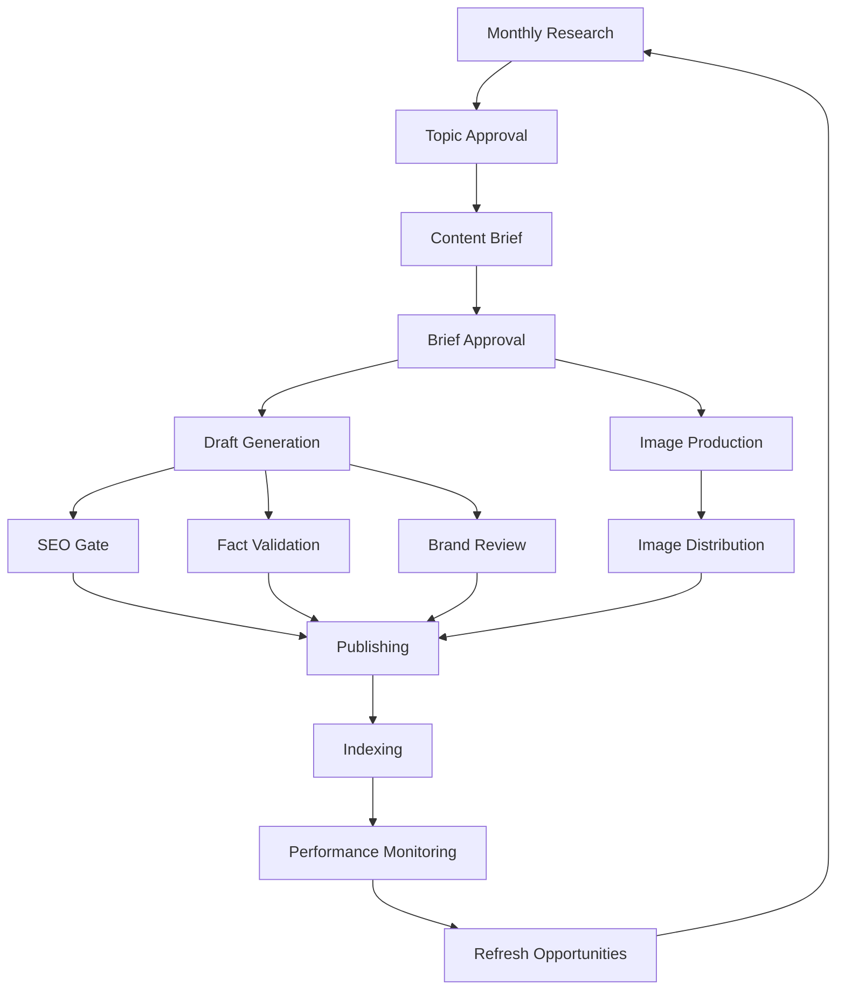
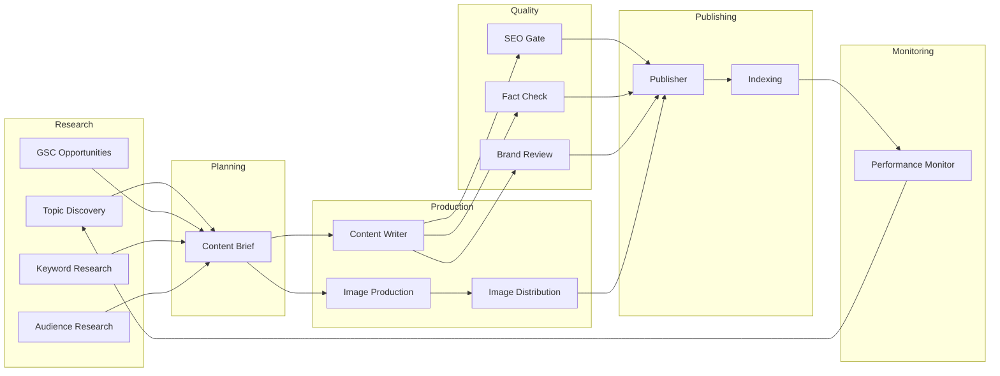
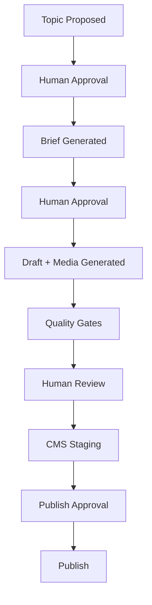
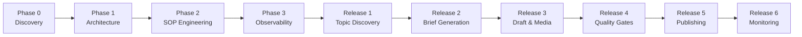

# Delivery Plan

> **Vision:** Build a Hermes-powered Content Operations Platform that transforms Kriti's blog production SOP into a scalable, observable, reusable, and maintainable multi-agent system while advancing Geidi's AI maturity programme.

---

# 1. Executive Summary

This is **not a blog writing bot**.

This is a **Content Operations System** that:

- Discovers opportunities
    
- Prioritizes existing-page optimization before new content
    
- Creates content briefs
    
- Produces drafts
    
- Generates and manages media
    
- Enforces SOP compliance
    
- Assists publishing
    
- Monitors performance
    
- Feeds learnings back into future content decisions
    

Humans remain responsible for:

- Topic approval
    
- Strategic SEO decisions
    
- Final fact approval
    
- Logo permissions
    
- Publish approval
    

This follows Kriti's SOP and Hermes' multi-agent philosophy.

---

# 2. End-State Vision

```text
Research
    ↓
Topic Approval
    ↓
Content Brief
    ↓
Brief Approval
    ↓
Draft + Media Creation
    ↓
Quality Gates
    ↓
Human Review
    ↓
CMS Staging
    ↓
Publish Approval
    ↓
Publishing
    ↓
Indexing
    ↓
Performance Monitoring
    ↓
Content Refresh & New Opportunities
```

---

# 3. Content Lifecycle Workflow



This directly mirrors Kriti's SOP:

- Monthly research
    
- Existing page optimization first
    
- Draft creation
    
- Quality gates
    
- Media workflow
    
- Publishing
    
- Monitoring and refreshes
    

---

# 4. Target Agent Architecture



---

# 5. Agent Catalog

|Agent|Responsibility|Output|
|---|---|---|
|Topic Discovery|Discover buyer-focused content opportunities.|Topic recommendations|
|GSC Opportunities|Find existing ranking opportunities (positions 3–20).|GSC opportunity list|
|Keyword Research|Validate volume, KD, and intent.|Keyword analysis|
|Audience Research|Extract Reddit, Quora, PAA, and audience questions.|FAQs, pain points, H2s|
|Content Brief|Convert approved topics into structured content plans.|Content brief|
|Content Writer|Create draft articles from approved briefs.|Draft article|
|Image Production|Create image plans, infographics, alt text, and asset specifications.|Media package|
|Image Distribution|Manage attribution records and image backlink opportunities.|Attribution & backlink records|
|SEO Gate|Validate SOP, SEO, AI-search readiness, and technical compliance.|PASS / FAIL report|
|Fact Check|Verify claims, statistics, and sources.|Fact validation report|
|Brand Review|Enforce MAAI house style and brand voice.|Brand review report|
|Publisher|Stage approved content inside CMS.|CMS draft|
|Indexing|Verify discoverability and indexing status.|Indexing report|
|Performance Monitor|Track rankings, traffic, and content decay.|Performance report|

This agent structure directly follows the SOP and Hermes multi-agent design guidance.

---

# 6. Human Approval Architecture



## Human-Controlled Decisions

- Topic Approval
    
- Existing vs New URL Decisions
    
- Final Fact Approval
    
- Competitor Comparisons
    
- Logo Permissions
    
- Publish Approval
    
- Outreach Approval
    

Following the SOP, automation supports decisions but does not replace accountability.

---

# 7. SOP Automation Strategy

## Fully Automated

|Capability|
|---|
|H1 validation|
|Keyword placement|
|TLDR validation|
|Metadata checks|
|URL slug checks|
|Internal link checks|
|Alt text checks|
|Heading hierarchy|
|AI-search checks|
|Banned phrase checks|
|Em dash detection|
|CTA detection|

---

## AI Assisted

|Capability|
|---|
|Existing vs New Page Recommendation|
|Audience Intent Matching|
|Brand Voice Review|
|Competitor Neutrality|
|EEAT Assessment|
|Content Usefulness|
|AI Search Readiness|

---

## Human Required

|Capability|
|---|
|Topic Approval|
|Brief Approval|
|Full Fact Verification|
|Logo Permissions|
|Publish Approval|
|Strategic SEO Decisions|

---

# 8. Observability Architecture

Observability is mandatory from Day 1.

## Track

```text
Workflow Runs

Agent Executions

Prompt History

Token Usage

Cost

Failures

Approval Decisions

Publishing Events

Performance Metrics

Quality Gate Results
```

## Example

```text
Workflow:
Monthly Topic Discovery

Run ID:
12345

Duration:
4m 32s

Cost:
$1.18

Topics Generated:
42

Approved:
8

Rejected:
34

Failures:
0
```

---

# 9. Governance Framework

## Workflow Validation Rule

Before implementing any capability:

|Question|Required|
|---|---|
|Can Hermes already do this?|Mandatory|
|Documentation Link|Mandatory|
|Why not use OOTB?|If No|
|Skill Exists?|Mandatory|
|Optional Skill Exists?|Mandatory|
|MCP Server Exists?|Mandatory|
|Official Integration Exists?|Mandatory|
|Why Custom?|Mandatory if Custom|

This rule prevents unnecessary engineering.

---

## Hermes Upgrade Safety Rule

Before creating custom functionality:

Document:

```text
If Hermes introduces this capability natively,
how will this custom implementation
be replaced?
```

This keeps the solution upgrade-safe.

---

## AI Maturity Review Gate

Before implementing any major capability:

|Area|Review|
|---|---|
|Existing Organizational Standard|Required|
|Reuse Opportunity|Required|
|Observability Alignment|Required|
|Agent Registry Alignment|Required|
|Evaluation Framework Alignment|Required|
|Shared MCP Alignment|Required|
|Recommendation|Required|

This project serves both Kriti and Geidi's AI maturity programme.

---

# 10. Delivery Roadmap



---

# Release 1 — Topic Discovery

### Business Outcome

Kriti receives monthly content opportunities.

### Deliverables

- Topic Discovery Agent
    
- GSC Opportunities Agent
    
- Keyword Research Agent
    
- Audience Research Agent
    
- Monthly Topic Report
    

### Demo

```text
/monthly-topic-research
```

---

# Release 2 — Brief Generation

### Business Outcome

Approved topics become structured briefs.

### Deliverables

- Brief Agent
    
- Brief Templates
    
- Approval Workflow
    

### Demo

```text
/create-brief
```

---

# Release 3 — Draft & Media Generation

### Business Outcome

Approved briefs become publish-ready drafts and media packages.

### Deliverables

- Writer Agent
    
- Image Production Agent
    
- Metadata Generation
    
- FAQ Generation
    
- Alt Text Generation
    

### Demo

```text
/create-draft
```

---

# Release 4 — Quality Gates

### Business Outcome

Every draft receives SOP validation.

### Deliverables

- SEO Gate Agent
    
- Fact Check Agent
    
- Brand Review Agent
    

### Demo

```text
/validate-draft
```

Output:

```text
PASS

Blocking Issues:
1.
2.

Required Human Checks:
1.
2.
```

---

# Release 5 — Publishing Workflow

### Business Outcome

Approved content becomes publish-ready.

### Deliverables

- Publisher Agent
    
- CMS Integration
    
- Indexing Agent
    
- Staging Workflow
    

### Demo

```text
/stage-post
```

---

# Release 6 — Performance Monitoring

### Business Outcome

Content performance becomes measurable and feeds future content decisions.

### Deliverables

- Performance Monitor
    
- Refresh Recommendations
    
- Monthly Reporting
    
- Feedback Loop Into Topic Discovery
    

### Demo

```text
/performance-report
```

---

# 11. Organizational AI Maturity Alignment

This project is also a Geidi AI maturity initiative.

Every component should contribute to:

```text
Reusable Agent Patterns

Shared MCP Infrastructure

Prompt Standards

Observability Standards

Evaluation Frameworks

Governance Controls

Agent Registry

Agent Cards

A2A Readiness

Future Agent-to-Agent Communication
```

The goal is not merely to automate content production.

The goal is to create a reusable blueprint for future AI systems.

---

# 12. Definition of Success

The project succeeds when:

✅ Kriti receives measurable business value

✅ Existing pages are optimized before new URLs

✅ SOP compliance becomes systematic

✅ Human review effort decreases

✅ Content quality increases

✅ Workflows are observable

✅ Architecture is reusable

✅ Custom code is minimized

✅ Future AI initiatives can reuse the patterns created here

---

# Final North Star

```text
Understand the Business

↓

Design the Architecture

↓

Convert SOP into Rules

↓

Build Observability First

↓

Deliver Value Incrementally

↓

Create Reusable AI Patterns

↓

Establish Kriti as Geidi's
Reference Content Operations Platform
```

This version is the one I would present to leadership because it is:

- concise,
    
- aligned with Kriti's SOP,
    
- aligned with Hermes best practices,
    
- aligned with Geidi AI maturity goals,
    
- easy to digest in 10–15 minutes,
    
- and detailed enough to serve as the implementation roadmap.