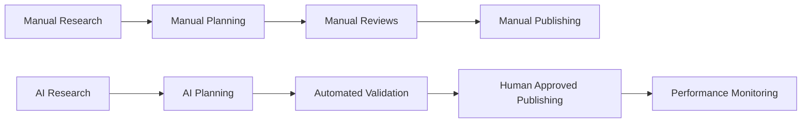
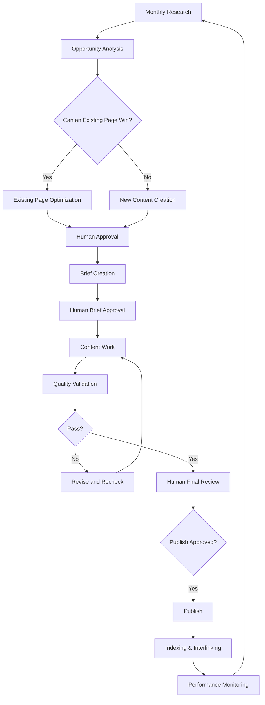
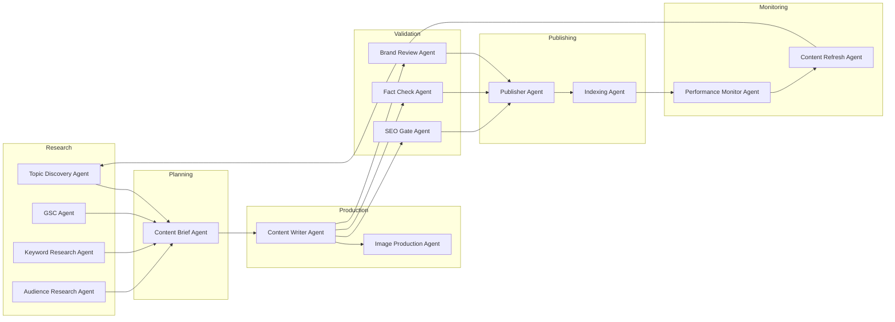
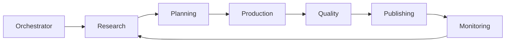
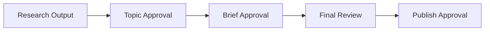
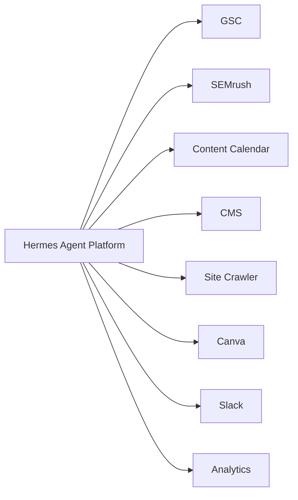
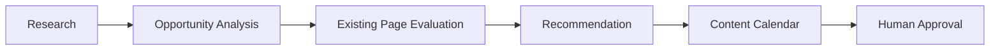
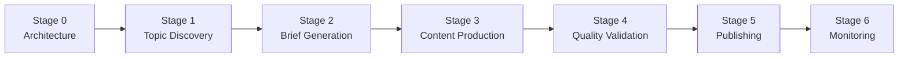

## Executive Summary

### Objective

Design an AI-assisted content operations platform that follows Kriti's content SOP, prioritizes existing-page optimization before creating new content, and introduces agent-driven workflows while keeping critical business decisions under human control.

### Expected Business Outcomes

- Automated topic opportunity discovery
    
- Existing-page optimization recommendations
    
- AI-assisted content planning and production
    
- SOP-driven quality validation
    
- Controlled publishing workflow
    
- Continuous SEO performance monitoring
    

---

# Current State → Future State

## Current State

|Current Challenges|
|---|
|Topic research is performed manually|
|Opportunities are spread across multiple tools|
|Existing-page opportunities are difficult to identify consistently|
|Quality reviews depend heavily on manual effort|
|Publishing and monitoring processes are fragmented|

## Future State

|Future Capability|
|---|
|Automated opportunity discovery|
|Existing-page optimization recommendations|
|Structured content planning|
|Automated quality validation|
|Human-controlled publishing|
|Continuous performance monitoring|

## Transformation Overview

---

# 1. Solution Architecture

## High-Level Workflow

### Workflow Summary

1. Discover opportunities.
    
2. Determine whether an existing page should be optimized.
    
3. Obtain human approval.
    
4. Create a brief.
    
5. Produce content.
    
6. Validate quality.
    
7. Complete human review.
    
8. Publish and monitor performance.

# Solution Architecture (Master Diagram)

# 2. Agent Architecture

## Agent Groups

|Layer|Agents|
|---|---|
|Research|Topic Discovery, GSC Opportunity, Keyword Research, Audience Research|
|Planning|Brief Agent|
|Production|Writer Agent, Media Agent|
|Quality|SEO Gate Agent, Fact Check Agent, Brand Review Agent|
|Publishing|Publisher Agent, Indexing Agent|
|Monitoring|Performance Agent|
|Coordination|Orchestrator Agent|

## Agent Flow

---

# 3. Governance & Human Controls

## Human Approval Gates

## Human-Controlled Decisions

|Decision|Human Required|
|---|---|
|Topic Approval|Yes|
|Existing Page vs New Content|Yes|
|Brief Approval|Yes|
|Final Review|Yes|
|Publish Approval|Yes|
|Image & Logo Permissions|Yes|
|Outreach Activities|Yes|

---

# 4. Integration Architecture

## Core Systems

|System|Purpose|
|---|---|
|Google Search Console|Performance and indexing insights|
|SEMrush|Keyword opportunity analysis|
|Content Calendar|Topic planning|
|CMS|Content staging and publishing|
|Site Crawler|Existing-page and internal-link analysis|
|Reddit / Quora / PAA|Audience research|
|Canva / Image Tools|Media generation support|
|Slack / Email|Notifications and approvals|
|Source Ledger|Fact validation|
|Analytics|Performance monitoring|

## Integration Overview

---

# 5. Hermes Capability Assessment

| Requirement            | Hermes Native | Skill | MCP | Custom | Recommendation |
| ---------------------- | ------------- | ----- | --- | ------ | -------------- |
| Monthly Topic Research | No            | Yes   | Yes | No     | Skill + MCP    |
| Content Brief Creation | Yes           | Yes   | No  | No     | Native + Skill |
| SEO Validation         | Partial       | Yes   | No  | No     | Skill          |
| Fact Checking          | Partial       | Yes   | No  | No     | Skill          |
| CMS Publishing         | No            | No    | Yes | No     | MCP            |
| Performance Monitoring | Partial       | No    | Yes | No     | MCP            |

# Hermes Upgrade Safety

|Component|Future Replacement Strategy|
|---|---|
|Custom SEO Checks|Replace with Hermes Native Validation|
|Custom CMS Publisher|Replace with Official Integration|
|Custom Research Workflow|Replace with Native Capability if available|
|Custom Fact Checker|Replace with Native Verification Services|
## 6. AI Maturity Alignment Review

### Purpose

Ensure this project contributes to Geidi's broader AI maturity programme and does not become an isolated implementation.

|Capability|Existing Organisational Capability|Alignment Opportunity|Recommendation|
|---|---|---|---|
|Agent Architecture|Agent Standards (TBD)|Create reusable content-operations reference architecture|Reuse organisational agent patterns where available|
|MCP Integrations|Shared MCP Infrastructure (TBD)|Reuse common connectors rather than project-specific integrations|Prefer shared MCP services|
|Observability|Tracing & Monitoring Standards (TBD)|Establish reusable workflow monitoring patterns|Implement observability from Stage 1|
|Evaluation Frameworks|Evaluation Standards (TBD)|Measure agent quality consistently across projects|Align with organisational evaluation framework|
|Governance|Governance Controls (TBD)|Apply standard approval and audit mechanisms|Reuse organisational governance controls|
|Agent Registry|Agent Registry (TBD)|Register reusable agents and capabilities|Design agents for future reuse|
|Prompt Management|Prompt Standards (TBD)|Avoid project-specific prompt sprawl|Follow shared prompt governance practices|

### Maturity Review Outcome

|Area|Status|
|---|---|
|Shared MCP Alignment|Required|
|Observability Alignment|Required|
|Evaluation Alignment|Required|
|Governance Alignment|Required|
|Reusable Agent Design|Required|
|Future Multi-Agent Compatibility|Required|
# 7. Observability Strategy

|Metric|Required|
|---|---|
|Workflow Runs|Yes|
|Agent Executions|Yes|
|Prompt History|Yes|
|Cost Tracking|Yes|
|Token Usage|Yes|
|Error Tracking|Yes|
|Approval Decisions|Yes|
|Agent Performance Metrics|Yes|
# **Stage 1 Scope**

## Stage 1 Objective

Deliver the first usable business capability:

> Automated Monthly Topic Opportunity Discovery

## Included Agents

- Orchestrator Agent
    
- Topic Discovery Agent
    
- GSC Opportunity Agent
    
- Keyword Research Agent
    
- Audience Research Agent
    

## Stage 1 Workflow

## Stage 1 Deliverable

### Monthly Topic Opportunity Report

|Keyword|Opportunity Type|Existing Page|Volume|KD|Recommendation|
|---|---|---|---|---|---|

## Stage 1 Success Criteria

- Topic opportunities automatically discovered
    
- Existing-page opportunities identified
    
- SEMrush metrics included
    
- Audience insights included
    
- Recommendations generated
    
- Opportunities added to content calendar
    
- Human approval workflow operational
    

---

# Delivery Roadmap

|Stage|Business Outcome|
|---|---|
|Stage 0|Approved architecture and implementation blueprint|
|Stage 1|Topic opportunity discovery|
|Stage 2|Content brief generation|
|Stage 3|Content production|
|Stage 4|SOP quality validation|
|Stage 5|Publishing workflow|
|Stage 6|Performance monitoring and optimization|

---

# 3. Risks & Assumptions

## Key Risks

- Missing GSC access
    
- Missing SEMrush access
    
- CMS integration limitations
    
- Human approval bottlenecks
    
- Poor content calendar quality
    
- Missing media permissions
    

## Key Assumptions

- Required platform access will be available
    
- Content calendar process is defined
    
- CMS access can be granted
    
- Human reviewers remain part of the workflow
    

---

# Stage 0 Approval Checklist

## Architecture

[]  Workflow approved
    
[]  Agent architecture approved
    
[]  Integration architecture approved
    

## Governance

[]  Governance framework approved
    
[]  Human approval model approved
    

## Delivery

[]  Stage 1 scope approved
    
[]  Roadmap approved
    
[]  Development authorized
    
