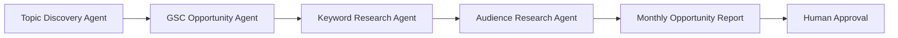
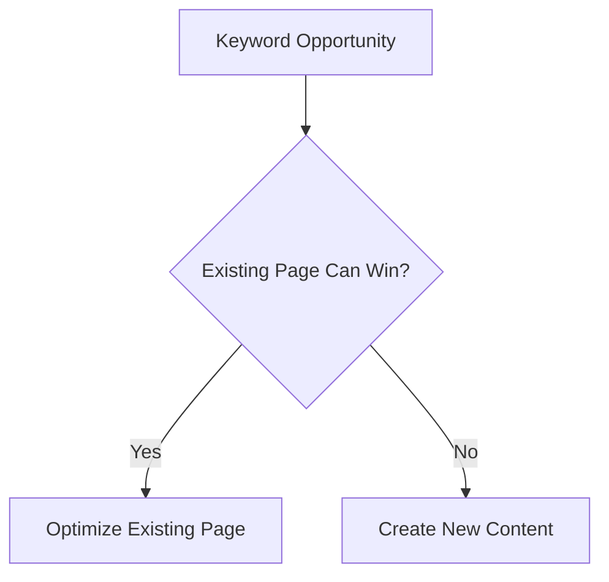
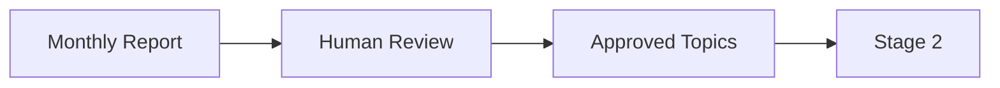
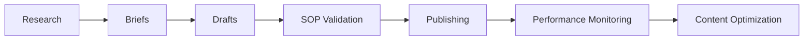

# Goal

## Business Outcome

Kriti receives a monthly report containing:

- Content opportunities
    
- Existing-page optimization opportunities
    
- Keyword data
    
- Audience questions
    
- Recommendations on whether to:
    
    - Improve an existing page
        
    - Create a new page
        

This directly supports Phase 0 and Phase 1 of the SOP.

---

# What We Build in Stage 1

## Agents

Only the Research Layer:



From the Stage 0 architecture these are the first agents delivered:

|Agent|Responsibility|
|---|---|
|Topic Discovery Agent|Finds content opportunities|
|GSC Opportunity Agent|Finds existing-page opportunities|
|Keyword Research Agent|Validates volume, KD, intent|
|Audience Research Agent|Collects Reddit, Quora, PAA questions|
|Orchestrator Agent|Coordinates research workflow|

---

# What Happens

## Step 1

Topic Discovery Agent gathers ideas.

Sources:

- SEMrush
    
- Existing content gaps
    
- Competitor opportunities
    

---

## Step 2

GSC Agent checks:

```text
Position 3-20 keywords

Impressions

Pages already ranking
```

This directly follows Kriti's SOP requirement.

---

## Step 3

Keyword Research Agent validates:

```text
Volume

Keyword Difficulty

Intent

Commercial Potential
```

---

## Step 4

Audience Research Agent collects:

```text
Reddit Questions

Quora Questions

People Also Ask
```

These become future H2s and FAQ opportunities.

---

## Step 5

System decides:



This is one of the most important SOP rules:

> Improve existing pages before creating new URLs.

---

## Step 6

Generate Monthly Opportunity Report

Example:

|Keyword|Volume|KD|Intent|Existing Page|Recommendation|
|---|---|---|---|---|---|
|CRM for Clinics|400|22|BOFU|Yes|Improve Existing|
|Best CRM for Clinics|600|28|BOFU|No|New Content|
|CRM Comparison|1200|35|MOFU|Yes|Improve Existing|

Plus:

```text
Audience Questions

Suggested H2s

Target Audience

Reasoning
```

---

# Human Approval

Stage 1 still follows Human-In-The-Loop.

Nothing is automatically approved.



This follows the project requirement that strategic SEO decisions remain human-controlled.

---

# Since This Is a Duo Project

This is where the work naturally splits.

## Person 1 — Architecture / Platform

Focus:

- Hermes setup
    
- Skills
    
- MCP integrations
    
- Workflow orchestration
    
- Observability
    
- Governance
    

Deliverables:

```text
Research workflow

Agent configuration

Data pipelines

Content calendar integration

Reporting
```

---

## Person 2 — SEO / Business Logic

Focus:

- SOP implementation
    
- Keyword logic
    
- Existing-page evaluation rules
    
- Topic scoring
    
- Report design
    
- Validation criteria
    

Deliverables:

```text
Keyword scoring model

Research templates

Approval workflows

Topic report format

Business acceptance criteria
```

---

# What Is the End Result of Stage 1?

The client can run:

```text
/monthly-topic-research
```

and receive a report like:

```text
20 keyword opportunities

10 existing-page opportunities

10 new-content opportunities

Audience questions

Topic recommendations

SEO metrics

Approval-ready content calendar
```

This is the first usable business capability promised in the roadmap.

---

# What Is the End Result of the Entire Duo Project?

After all stages:



Kriti ends up with:

✅ Automated topic discovery  
✅ Existing-page optimization recommendations  
✅ AI-generated content briefs  
✅ AI-generated drafts  
✅ SOP validation gates  
✅ Publishing workflow  
✅ Performance monitoring  
✅ Continuous content improvement loop

while keeping humans responsible for:

- Topic approval
    
- Fact approval
    
- Strategic SEO decisions
    
- Publishing approval
    
