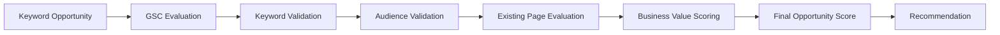

# Keyword Opportunity Scoring Framework 

## Purpose

Provide a consistent method for evaluating, prioritizing, and recommending content opportunities discovered during Stage 1 research.

The framework ensures opportunities align with:

- Kriti's SEO SOP
    
- Existing-page-first strategy
    
- Commercial intent priorities
    
- Audience demand
    
- EEAT suitability
    
- Business value
    

The output is used to determine:

```text
Priority Level

Optimize Existing Page
or

Create New Content
```

---

# Opportunity Evaluation Workflow



---

# Scoring Categories

|Category|Weight|
|---|--:|
|Existing Page Opportunity|20|
|GSC Opportunity|15|
|Search Intent|15|
|Business Value|15|
|Audience Demand|10|
|Search Volume|10|
|Keyword Difficulty|5|
|EEAT Alignment|5|
|Content Gap Opportunity|5|
|**Total**|**100**|

---

# 1. Existing Page Opportunity (20 Points)

## Why It Matters

Kriti's SOP requires:

> Optimize existing pages before creating new URLs.

This is the highest-weight category.

### Scoring

|Condition|Score|
|---|--:|
|Existing page strongly matches intent and can be improved|20|
|Existing page partially matches and can be expanded|15|
|Existing page exists but intent mismatch|5|
|No suitable page exists|0|

### Required Data

```text
Existing Page URL

Current Ranking Position

Current Impressions

Intent Match

Expansion Opportunities
```

---

# 2. GSC Opportunity (15 Points)

## Why It Matters

The SOP prioritizes:

```text
Position 3–20 Keywords
+
Existing Impressions
```

### Scoring

|Condition|Score|
|---|--:|
|Position 3–10 with impressions|15|
|Position 11–20 with impressions|12|
|Position 21–30 with impressions|8|
|No ranking data available|0|

### Required Data

```text
Keyword

Current Position

Impressions

Ranking URL
```

---

# 3. Search Intent (15 Points)

## Why It Matters

The SOP explicitly prioritizes:

```text
Bottom Funnel

Middle Funnel
```

over traffic-only opportunities.

### Scoring

|Intent|Score|
|---|--:|
|BOFU|15|
|MOFU|10|
|TOFU with clear conversion path|5|
|Pure informational traffic|0|

### Examples

|Intent|Example|
|---|---|
|BOFU|CRM for Clinics|
|BOFU|Best CRM for Clinics|
|MOFU|CRM Comparison|
|TOFU|What is CRM|

---

# 4. Business Value (15 Points)

## Why It Matters

Traffic is not the goal.

Potential customers are.

### Scoring

|Condition|Score|
|---|--:|
|Direct revenue opportunity|15|
|Strong lead generation opportunity|12|
|Supporting conversion journey|8|
|Awareness only|3|
|No clear business value|0|

---

# 5. Audience Demand (10 Points)

## Why It Matters

The SOP requires mining:

- Reddit
    
- Quora
    
- People Also Ask
    
- Answer The Public
    

### Scoring

|Evidence|Score|
|---|--:|
|Strong demand across multiple sources|10|
|Demand across one major source|7|
|Some evidence of demand|4|
|No audience demand found|0|

---

# 6. Search Volume (10 Points)

## Why It Matters

Volume matters, but should not dominate prioritization.

### Scoring

|Monthly Volume|Score|
|---|--:|
|1000+|10|
|500–999|8|
|100–499|6|
|10–99|4|
|0–9|2|

### Note

BOFU opportunities can still be approved even with low search volume.

---

# 7. Keyword Difficulty (5 Points)

## Why It Matters

Stage 1 focuses on finding winnable opportunities.

### Scoring

|KD|Score|
|---|--:|
|0–20|5|
|21–35|4|
|36–50|3|
|51–70|2|
|71+|1|

---

# 8. EEAT Alignment (5 Points)

## Why It Matters

The SOP requires prioritizing topics where the client can demonstrate genuine expertise.

### Scoring

|Condition|Score|
|---|--:|
|Strong expertise and authority|5|
|Good expertise|4|
|Moderate expertise|2|
|Weak expertise|0|

---

# 9. Content Gap Opportunity (5 Points)

## Why It Matters

Stage 1 research includes competitor and content-gap discovery.

### Scoring

|Condition|Score|
|---|--:|
|High-value content gap|5|
|Moderate content gap|3|
|Low content gap|1|
|No meaningful gap|0|

---

# Opportunity Source Priority

When two opportunities have similar scores, prioritize in this order:

| Priority | Source                                 |
| -------- | -------------------------------------- |
| 1        | GSC Position 3–20 Opportunity          |
| 2        | Existing Page Optimization Opportunity |
| 3        | BOFU Modifier Opportunity              |
| 4        | SEMrush Opportunity                    |
| 5        | Audience Research Opportunity          |

This follows Kriti's SOP emphasis on existing-page optimization before net-new content.

---

# Final Opportunity Rating

|Score|Priority|
|---|---|
|80–100|Critical|
|65–79|High|
|50–64|Medium|
|35–49|Low|
|Below 35|Reject|

---

# Recommendation Rules

## Optimize Existing Page

Recommend when:

```text
Existing Page Opportunity ≥ 15

AND

Intent Match = Yes
```

---

## Create New Content

Recommend when:

```text
No Existing Page Exists

OR

Existing Page Cannot Serve Intent
```

---

# Opportunity Scorecard Template

|Field|Value|
|---|---|
|Keyword||
|Opportunity Source||
|Volume||
|KD||
|Intent||
|Target Audience||
|Existing Page URL||
|Current Position||
|Current Impressions||
|Existing Page Score||
|GSC Score||
|Intent Score||
|Business Value Score||
|Audience Demand Score||
|Volume Score||
|KD Score||
|EEAT Score||
|Content Gap Score||
|Final Score||
|Priority||
|Recommendation||
|Reasoning||

---

## Acceptance Criteria

A keyword opportunity can only move into the Monthly Opportunity Report if:

- Opportunity score calculated
    
- Intent classified
    
- Existing page evaluation completed
    
- GSC data reviewed (where available)
    
- Audience research completed
    
- EEAT assessment completed
    
- Recommendation generated
    
- Supporting reasoning documented
    

