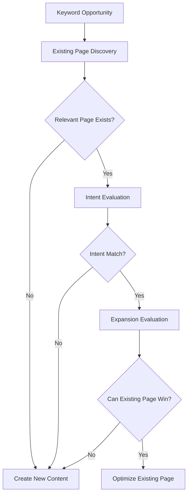

# Existing Page Evaluation & Recommendation Framework

## Purpose

Provide a consistent decision-making framework for determining whether a keyword opportunity should:

- Improve an existing page
    
- Expand an existing page
    
- Create a new page
    

The framework enforces Kriti's highest-priority SEO principle:

> Optimize existing pages before creating new content.

The output becomes the official recommendation included in the Monthly Opportunity Report.

---

# Why This Matters

Without a structured evaluation process, content teams often create unnecessary pages.

This creates:

- Keyword cannibalization
    
- Duplicate intent
    
- Authority dilution
    
- Additional maintenance overhead
    

The goal is to maximize existing assets before introducing new URLs.

---

# Framework Workflow



---

# Evaluation Criteria

|Criteria|Weight|
|---|--:|
|Intent Match|30|
|Expansion Potential|25|
|Existing Performance|20|
|Cannibalization Risk|15|
|Business Value|10|
|Total|100|

---

# Step 1 — Existing Page Discovery

## Goal

Identify whether a page already exists that targets similar user intent.

---

## Sources

|Source|Purpose|
|---|---|
|CMS|Existing content inventory|
|Site Crawler|URL discovery|
|Sitemap|Published content|
|Internal Search|Supporting validation|

---

## Required Output

|Field|Value|
|---|---|
|URL||
|Page Title||
|Primary Topic||
|Ranking Keywords||
|Current Traffic||
|Last Updated||

---

# Step 2 — Intent Match Evaluation

## Goal

Determine whether the keyword and existing page serve the same search intent.

---

## Intent Categories

|Intent Type|
|---|
|BOFU|
|MOFU|
|Comparison|
|Alternative|
|Pricing|
|Solution-Specific|
|Informational|

---

## Scoring

|Match Level|Score|
|---|--:|
|Exact Match|30|
|Strong Match|25|
|Partial Match|15|
|Weak Match|5|
|No Match|0|

---

## Example

### Existing Page

```text
CRM Software Guide
```

### Opportunity

```text
CRM for Clinics
```

Result:

```text
Strong Match
```

---

# Step 3 — Expansion Potential Evaluation

## Goal

Determine whether the keyword can be incorporated naturally into the existing page.

---

## Evaluation Questions

### Coverage

```text
Can the page reasonably address this topic?
```

### Structure

```text
Can a new H2 or section support the keyword?
```

### User Experience

```text
Will expansion improve the page?
```

### SEO Impact

```text
Will expansion improve rankings?
```

---

## Scoring

|Condition|Score|
|---|--:|
|Easily expandable|25|
|Expandable with moderate effort|20|
|Requires significant restructuring|10|
|Expansion would reduce quality|0|

---

# Step 4 — Existing Performance Evaluation

## Goal

Prioritize pages already demonstrating ranking potential.

This follows the SOP requirement to prioritize:

```text
Position 3–20
+
Existing Impressions
```

---

## Metrics Reviewed

|Metric|
|---|
|Position|
|Impressions|
|Clicks|
|CTR|

---

## Scoring

|Performance|Score|
|---|--:|
|Position 3–10|20|
|Position 11–20|15|
|Position 21–30|10|
|Position 31+|5|
|No visibility|0|

---

# Step 5 — Cannibalization Risk Evaluation

## Goal

Avoid creating pages that compete against existing content.

---

## Risk Levels

|Risk|Score|
|---|--:|
|High|15|
|Medium|8|
|Low|0|

Higher scores favor existing-page optimization.

---

## Example

### Existing

```text
Best CRM Software
```

### Proposed

```text
Top CRM Software
```

Result:

```text
High Cannibalization Risk
```

Recommendation:

```text
Optimize Existing Page
```

---

# Step 6 — Business Value Evaluation

## Goal

Ensure recommendations support buyers, users, or warm leads.

This directly follows Kriti's SOP.

---

## Scoring

|Business Value|Score|
|---|--:|
|Direct revenue opportunity|10|
|Strong lead generation|8|
|User enablement|5|
|Awareness only|2|
|No business value|0|

---

# Recommendation Logic

## Optimize Existing Page

Recommend when:

```text
Intent Match ≥ 25

AND

Expansion Potential ≥ 20

AND

Existing Page Exists
```

---

## Create New Content

Recommend when:

```text
No Suitable Existing Page

OR

Intent Match < 15

OR

Expansion Potential < 10
```

---

# Recommendation Types

|Recommendation|Description|
|---|---|
|Optimize Existing Page|Update and improve current content|
|Expand Existing Page|Add significant new sections|
|Create New Content|New URL required|
|Reject Opportunity|Insufficient value|

---

# Evaluation Output Template

## Keyword

CRM for Clinics

---

## Existing Page

```text
/clientsite/crm-software-guide
```

---

## Evaluation Summary

|Criteria|Score|
|---|--:|
|Intent Match|25|
|Expansion Potential|25|
|Existing Performance|15|
|Cannibalization Risk|15|
|Business Value|10|
|Total Score|90|

---

## Recommendation

```text
Optimize Existing Page
```

---

## Reasoning

```text
The existing CRM Software Guide already targets CRM selection intent.

The page can support a clinic-focused section without changing primary intent.

The page currently ranks within the target GSC opportunity range and receives impressions.

Creating a new page would likely introduce keyword cannibalization.
```

---

# Integration With Other Deliverables

## Deliverable 1

Provides:

```text
Existing Page Opportunity Score
```

for the Keyword Opportunity Scoring Framework.

---

## Deliverable 2

Provides:

```text
Recommendation

Reasoning
```

for the Monthly Opportunity Report.

---

## Deliverable 3

Provides:

```text
Audience Questions

Pain Points

Suggested H2 Opportunities
```

used during expansion evaluation.

---

# Agent Output Requirements

The Existing Page Evaluation Agent must generate:

```text
Existing Page URL

Intent Analysis

Expansion Analysis

Performance Analysis

Cannibalization Analysis

Business Value Assessment

Final Recommendation

Supporting Reasoning
```

---

# Success Criteria

An evaluation is complete when:

- Existing pages reviewed
    
- Intent evaluated
    
- Expansion potential evaluated
    
- GSC performance reviewed
    
- Cannibalization risk reviewed
    
- Business value assessed
    
- Recommendation generated
    
- Reasoning documented
    

---

# Deliverable Output

For every keyword opportunity the system produces:

```text
✓ Existing Page Identified

✓ Intent Match Score

✓ Expansion Potential Score

✓ Performance Score

✓ Cannibalization Score

✓ Business Value Score

✓ Final Recommendation

✓ Supporting Reasoning
```

This is the strongest final Deliverable 4 because it directly implements the SOP's most important rule, fits the Stage 1 workflow exactly, feeds Deliverables 1–3, and gives the future Existing Page Evaluation Agent clear business rules to execute.