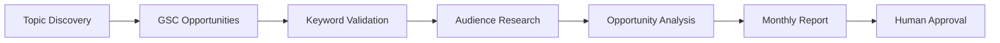
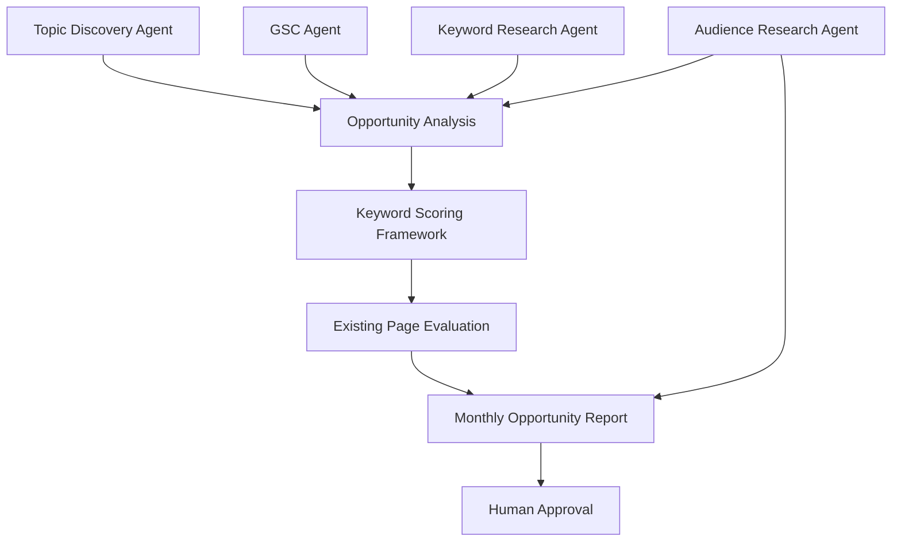
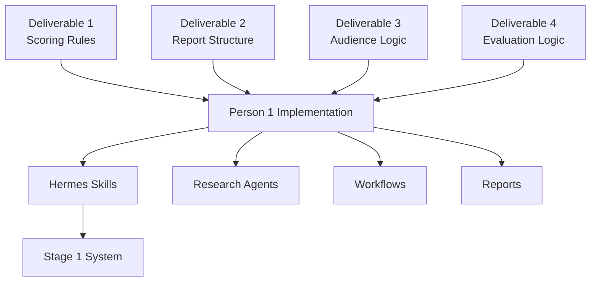

## For Person 1 (Platform / Hermes Implementation)

### Purpose

These deliverables define **how the agents should think**.

Your job is **not** to decide SEO strategy.

Your job is to build the workflows, agents, skills, and integrations that execute these rules.

---

# What You Need To Build

Stage 1 delivers:



Goal:

```text
Generate an approval-ready Monthly Topic Opportunity Report.
```

---

# [[Deliverable 1]]

# Keyword Opportunity Scoring Framework

### What It Is

A scoring system that determines:

```text
Which opportunities are worth pursuing.
```

### What You Need To Build

Create a scoring component that receives:

```text
Keyword

Volume

KD

Intent

GSC Data

Audience Data

Existing Page Analysis
```

And returns:

```text
Opportunity Score

Priority

Recommendation
```

### Output Example

```text
Keyword:
CRM for Clinics

Score:
92

Priority:
Critical

Recommendation:
Optimize Existing Page
```

Do Not Allow: the agent to invent its own scoring logic.

### Use the scoring rules from Deliverable 1.

---

# [[Deliverable 2]]

# Monthly Opportunity Report

### What It Is

The final Stage 1 output.

### What You Need To Build

Create a report generator that consolidates all research outputs.

### Required Sections

```text
Executive Summary

Existing Page Opportunities

New Content Opportunities

Audience Insights

Approval Queue
```

### Output

```text
/monthly-topic-research
```

should generate this report.

### Goal

A human should be able to review and approve topics directly from this report.

---

# [[Deliverable 3]]

# Audience Research Framework

### What It Is

Rules for discovering audience needs.

### What You Need To Build

Audience Research Agent.

### Agent Responsibilities

Collect:

```text
Reddit Questions

Quora Questions

People Also Ask
```

Then generate:

```text
Themes

Pain Points

Suggested H2s

Suggested FAQs

Content Opportunities
```

### Example

Input:

```text
CRM for Clinics
```

Output:

```text
Questions

Pain Points

Suggested H2s

Suggested FAQs
```

### Goal

Provide research insights that improve content planning.

---

# [[Deliverable 4]]

# Existing Page Evaluation Framework

### What It Is

The decision engine for:

```text
Optimize Existing Page

or

Create New Content
```

### What You Need To Build

Existing Page Evaluation Agent.

### Agent Responsibilities

For each keyword:

```text
Find Existing Pages

Evaluate Intent Match

Evaluate Expansion Potential

Evaluate Existing Performance

Evaluate Cannibalization Risk

Generate Recommendation
```

### Output Example

```text
Keyword:
CRM for Clinics

Existing Page:
crm-software-guide

Recommendation:
Optimize Existing Page

Reason:
Strong intent match and expansion opportunity.
```

### Goal

Enforce Kriti's core rule:

```text
Optimize existing pages before creating new content.
```

---

# How Everything Fits Together



---

# What You Own

Build:

```text
Hermes Profiles

Skills

MCP Integrations

Workflows

Report Generation

Content Calendar Integration

Human Approval Workflow
```

Examples:

- GSC Integration
    
- SEMrush Integration
    
- Reddit/PAA Retrieval
    
- Opportunity Scoring Skill
    
- Existing Page Evaluation Agent
    
- Monthly Report Generator
    

---

# What You Do NOT Own

Do not redefine:

```text
Keyword Scoring

SEO Prioritization

Audience Research Logic

Existing vs New Content Logic

Approval Criteria
```

Those rules already exist in Deliverables 1–4.

---

# Success Criteria

Stage 1 is complete when:

```text
✓ Opportunities automatically discovered

✓ Existing-page opportunities identified

✓ Audience insights collected

✓ Opportunity scores generated

✓ Recommendations generated

✓ Monthly report generated

✓ Human approval workflow operational
```

### Simple Rule

Think of the deliverables as:

|Deliverable|What You Build|
|---|---|
|Deliverable 1|Opportunity Scoring Skill|
|Deliverable 2|Monthly Report Generator|
|Deliverable 3|Audience Research Agent|
|Deliverable 4|Existing Page Evaluation Agent|

Your responsibility is building the system.

The deliverables define how the system should behave. The simplest way to think about it is:

```text
These deliverables are NOT outputs.

These deliverables are specifications.
```

You should treat them exactly like a software engineer would treat a requirements document.

---

# In Software Terms

Your deliverables are:

```text
Requirements
```

Person 1 creates:

```text
Implementation
```

Example:

|Your Deliverable|Person 1 Builds|
|---|---|
|Scoring Framework|Scoring Skill|
|Report Framework|Report Generator|
|Audience Framework|Audience Research Agent|
|Evaluation Framework|Existing Page Evaluation Agent|

---

# The Actual Workflow



# Use the deliverables as my **functional specification**.

Do not rewrite them.

Translate them into:

- Hermes Skills
    
- Agent prompts
    
- Workflow steps
    
- MCP integrations
    
- Report templates
    
- Approval workflows
    

The deliverables tell you **what the system must do**. Your job is to build **how the system does it**.