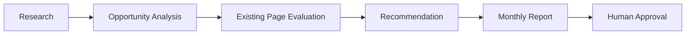

# Stage 1 Acceptance Criteria

These become the testing checklist for Person 1.

---

## AC-1 Research Collection

System must collect opportunities from:

### Required Sources

```text
GSC

SEMrush

Reddit

Quora

People Also Ask
```

Pass:

All sources included.

Fail:

Any source missing.

---

## AC-2 Existing Page Evaluation

For every opportunity:

System must determine:

```text
Existing Page Exists?

Can Existing Page Win?

Recommendation
```

Pass:

Decision produced.

Fail:

Decision missing.

---

## AC-3 Opportunity Scoring

Every opportunity must receive:

```text
Opportunity Score

0-100
```

Using Deliverable 1 framework.

Pass:

All opportunities scored.

Fail:

Missing score.

---

## AC-4 Audience Research

Each topic must contain:

```text
Audience Questions

Audience Source

Intent
```

Pass:

Included.

Fail:

Missing.

---

## AC-5 Recommendation Engine

Every topic must output:

```text
Optimize Existing

or

Create New
```

Pass:

Recommendation generated.

Fail:

No recommendation.

---

## AC-6 Monthly Report Generation

System generates:

```text
Monthly Topic Opportunity Report
```

Containing:

```text
Keyword

Volume

KD

Intent

Existing Page

Recommendation

Audience Insights
```

Pass:

Report generated.

Fail:

Missing sections.

---

## AC-7 Human Approval Workflow

Report must contain:

```text
Pending Approval
```

state.

Pass:

Approval workflow exists.

Fail:

No approval state.

---

## AC-8 Content Calendar Output

Approved topics can be exported into:

```text
Content Calendar
```

Pass:

Calendar-ready output.

Fail:

No structured export.

---

# What Person 1 Must Build

## Required Agents

```text
Orchestrator Agent

Topic Discovery Agent

GSC Opportunity Agent

Keyword Research Agent

Audience Research Agent
```

As defined in the architecture.

---

## Required Workflow



---

## Required Command

```text
/monthly-topic-research
```

Expected result:

```text
Monthly Topic Opportunity Report
```

---

# Stage 1 Test Plan

When Person 1 finishes implementation:

Run:

```text
/monthly-topic-research
```

Test against:

### Test Case 1

Keyword already ranking:

```text
Position 8

500 impressions
```

Expected:

```text
Optimize Existing Page
```

---

### Test Case 2

No existing URL.

Expected:

```text
Create New Content
```

---

### Test Case 3

Audience Question Found

Expected:

```text
Question appears in report
```

---

### Test Case 4

Opportunity Scoring

Expected:

```text
Score generated
```

---

### Test Case 5

Monthly Report

Expected:

All required sections present.

---

# Stage 1 Approval Checklist

After testing:

## Business Logic

-  Scoring Framework implemented
    
-  Existing Page Framework implemented
    
-  Audience Framework implemented
    
-  Report Framework implemented
    

---

## Workflow

-  Research workflow functional
    
-  Recommendation workflow functional
    
-  Approval workflow functional
    

---

## Output

-  Monthly report generated
    
-  Existing-page opportunities identified
    
-  New-content opportunities identified
    
-  Audience insights included
    

---

## Final Decision

### Approve Stage 1

Requirements:

```text
All Acceptance Criteria Pass
```

Result:

```text
Stage 1 Approved

Ready for Stage 2
```

---

### Reject Stage 1

Requirements:

```text
One or more Acceptance Criteria Fail
```

Result:

```text
Stage 1 Rejected

Return to Person 1

Fix failed criteria

Retest
```

This package is what you should send to Person 1. Once they implement it, your role becomes QA reviewer and approver for Stage 1 before the team proceeds to Stage 2.