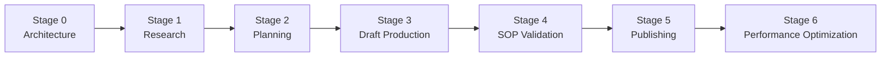
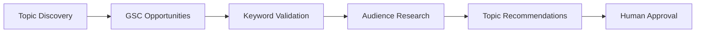
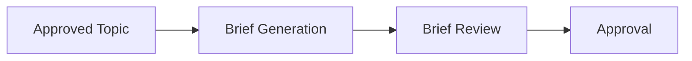
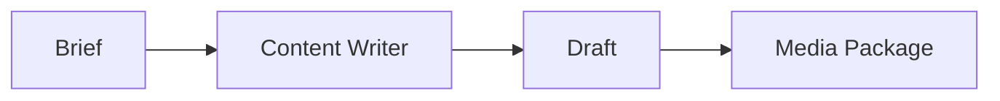
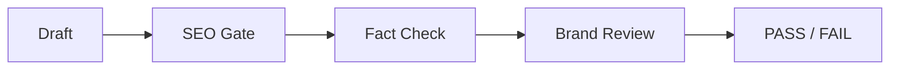
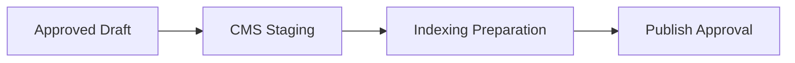
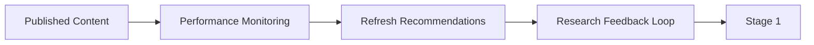
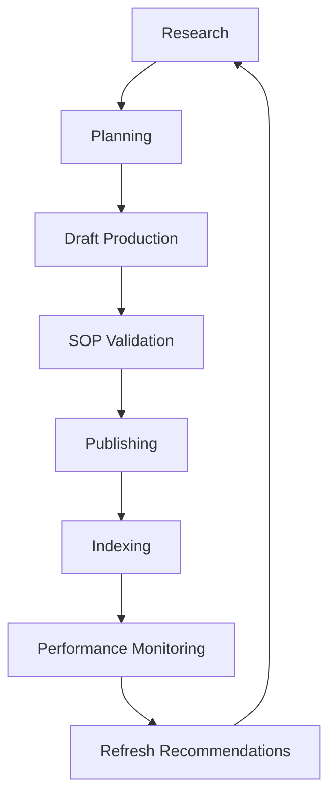

# Kriti Marketing & Blog Automation

> **Project Goal**
> 
> Deliver continuous business value to Kriti while simultaneously advancing Geidi's AI maturity programme through reusable patterns, observability standards, governance controls, and agent architecture best practices.

---

# Guiding Principles

### 1. Business Value First

Every stage must deliver a usable client capability.

### 2. Human-In-The-Loop

Automation supports decisions.

Humans remain accountable for:

- Topic Approval
    
- Strategic SEO Decisions
    
- Fact Approval
    
- Publish Approval
    

### 3. Reuse Before Reinvention

Before building anything:

```text
Can Hermes already do this?

Can a Skill do this?

Can an MCP do this?

Is there an official integration?

Why are we building custom?
```

### 4. Observability From Day One

Observability is not a future phase.

Every stage contributes to:

- Tracing
    
- Cost Monitoring
    
- Workflow Visibility
    
- Evaluation
    

---

# Programme Overview



---

# What Kriti Gets After Each Stage

| Stage   | Client Capability               |
| ------- | ------------------------------- |
| Stage 1 | Discover content opportunities  |
| Stage 2 | Generate content briefs         |
| Stage 3 | Generate article drafts         |
| Stage 4 | Validate drafts against SOP     |
| Stage 5 | Stage content for publishing    |
| Stage 6 | Monitor and improve performance |

---

# Stage 0 — Architecture & Workflow Design

## Business Outcome

Approved solution design.

## Deliverables

### Architecture

- Agent Architecture
    
- Workflow Architecture
    
- Integration Architecture
    

### Documentation

- Agent Catalog
    
- Workflow Diagrams
    
- Delivery Roadmap
    

### Governance

- Workflow Validation Framework
    
- Upgrade Safety Framework
    

## Success Criteria

- Architecture approved
    
- Workflow approved
    
- Scope approved
    

---

# Stage 1 — Monthly Content Research

## Business Outcome

Kriti receives monthly content opportunities backed by SEO and audience research.

## Problem Solved

Manual topic discovery.

## Workflow



## Agents Delivered

### Topic Discovery Agent

Finds content opportunities.

### GSC Opportunities Agent

Identifies existing-page opportunities.

### Keyword Research Agent

Validates:

- Volume
    
- KD
    
- Intent
    

### Audience Research Agent

Collects:

- Reddit Questions
    
- Quora Questions
    
- PAA Questions
    

## Deliverable

### Monthly Topic Report

```text
Keyword

Volume

KD

Intent

Target Audience

Existing Page Opportunity

Recommendation

Audience Questions
```

## Demo

```text
/monthly-topic-research
```

## Success Criteria

- Monthly research report generated
    
- Existing-page opportunities identified
    
- Topics approved by team
    

---

# Stage 2 — Content Planning

## Business Outcome

Approved topics become structured content briefs.

## Problem Solved

Manual brief creation.

## Workflow



## Agents Delivered

### Content Brief Agent

Creates:

- H1
    
- H2 Structure
    
- Intent Mapping
    
- CTA Requirements
    
- Internal Link Requirements
    
- Media Requirements
    

## Deliverable

### Content Brief

```text
Keyword

Intent

Audience

Outline

FAQs

CTA

Internal Links

Media Requirements
```

## Demo

```text
/create-brief
```

## Success Criteria

- Brief follows SOP
    
- Brief approved by team
    

---

# Stage 3 — Draft Production

## Business Outcome

Approved briefs become complete article drafts.

## Problem Solved

Manual content creation.

## Workflow



## Agents Delivered

### Content Writer Agent

Produces:

- Draft
    
- TLDR
    
- Metadata
    
- FAQ Section
    
- URL Slug
    

### Image Production Agent

Produces:

- Hero Image Requirements
    
- Infographic Requirements
    
- Alt Text
    
- File Naming Standards
    

## Deliverable

### Draft Package

```text
Draft

TLDR

Metadata

FAQ

Media Package
```

## Demo

```text
/create-draft
```

## Success Criteria

- Draft generated
    
- Metadata generated
    
- Media package generated
    

---

# Stage 4 — Automated SOP Validation

## Business Outcome

Every article is reviewed against Kriti's SOP before human review.

## Problem Solved

Inconsistent quality assurance.

## Workflow



## Agents Delivered

### SEO Gate Agent

Checks:

- Metadata
    
- H1
    
- Keyword Placement
    
- Internal Links
    
- AI Search Readiness
    

### Fact Check Agent

Checks:

- Claims
    
- Statistics
    
- Sources
    

### Brand Review Agent

Checks:

- Brand Voice
    
- Readability
    
- Competitor Neutrality
    
- Style Rules
    

## Deliverable

### Validation Report

```text
PASS / FAIL

Blocking Issues

Warnings

Required Human Checks
```

## Demo

```text
/validate-draft
```

## Success Criteria

- SOP validation executed
    
- Pass/fail report generated
    

---

# Stage 5 — Publishing Workflow

## Business Outcome

Approved content becomes publish-ready.

## Problem Solved

Manual CMS preparation.

## Workflow



## Agents Delivered

### Publisher Agent

- CMS Draft Creation
    
- Metadata Population
    
- Media Upload
    

### Indexing Agent

- Sitemap Verification
    
- Search Console Workflow
    
- Index Status Tracking
    

## Deliverable

### Publish-Ready Draft

## Demo

```text
/stage-post
```

## Success Criteria

- CMS draft created
    
- Metadata populated
    
- Publish approval ready
    

---

# Stage 6 — Performance Optimization

## Business Outcome

Kriti continuously improves content performance.

## Problem Solved

No structured optimization process.

## Workflow



## Agents Delivered

### Performance Monitoring Agent

Tracks:

- Rankings
    
- CTR
    
- Traffic
    
- Impressions
    

### Content Refresh Agent

Recommends:

- Updates
    
- Expansions
    
- Internal Linking Improvements
    

## Deliverable

### Performance Report

```text
Top Performers

Declining Content

Refresh Candidates

New Opportunities
```

## Demo

```text
/performance-report
```

## Success Criteria

- Content monitored
    
- Refresh opportunities generated
    
- Feedback loop established
    

---

# Architecture Governance Gate

Before implementing any capability:

| Question                          | Required            |
| --------------------------------- | ------------------- |
| Can Hermes already do this?       | Yes                 |
| Documentation Link                | Mandatory           |
| Is there a Skill?                 | Mandatory           |
| Is there an Optional Skill?       | Mandatory           |
| Is there an MCP Server?           | Mandatory           |
| Is there an Official Integration? | Mandatory           |
| Why Custom?                       | Mandatory if custom |

---

# Hermes Upgrade Safety Rule

Before implementing any custom component:

Document:

```text
If Hermes introduces this capability natively,
how will this custom implementation
be replaced?
```

This prevents unnecessary technical debt and aligns with the Hermes-first philosophy.

---

# End-State Vision



## Success Definition

The project succeeds when:

[] Kriti receives measurable business value

[] Every release delivers a usable capability

[] SOP compliance becomes systematic

[] Human effort decreases

[] Observability exists from day one

[] Architecture remains Hermes-aligned

[] Patterns become reusable for future AI initiatives

[] The solution contributes to Geidi's AI maturity programme


**Client value delivered by stage**

Each stage adds a complete business capability.

|stage|value|
|---|---|
|Research|1|
|Planning|2|
|Drafts|3|
|Validation|4|
|Publishing|5|
|Optimization|6|
