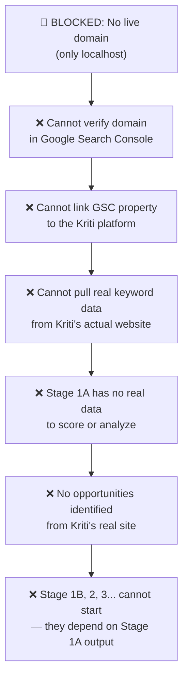

# Problem Diagnosis: Cannot Connect to Google Search Console — No Live Domain

> [!danger] Blocking Issue
> The Kriti platform is currently running on **localhost only** (a local development server on our machine). Google Search Console **requires a publicly accessible, verified domain** to function. Until the app is deployed to a real URL, the GSC integration cannot be set up, tested, or used in production.

---

## 1. What is the Problem (Plain Language)

Google Search Console (GSC) is the data source that powers **all of Stage 1A**. It provides the keyword rankings, impressions, clicks, and positions that the tool scores and analyzes.

Right now, the app lives at `http://localhost:8000` — an address that only exists on our development machine. Google cannot reach it. GSC cannot verify it. The integration cannot proceed.

> [!quote] Analogy
> It's like asking someone to mail a letter to your house, but not giving them a real street address — just saying "it's in my room." GSC needs a real, public address (a domain) to connect to.

---

## 2. What Exactly is Blocked

This is not a minor inconvenience. The localhost limitation blocks a **chain of dependent steps**. Nothing below this line can proceed until the deployment blocker is resolved.

### Blocked Items (in detail)

| # | What is Blocked | Why It's Blocked |
|---|---|---|
| 1 | **GSC domain verification** | GSC requires uploading an HTML file or DNS record to a *live, public* domain. Localhost has neither. |
| 2 | **GSC property setup** | A GSC "property" is tied to a real URL (e.g. `https://kriti.com`). You cannot create a property for `localhost`. |
| 3 | **Real keyword data import** | GSC only exports data for pages it has *crawled* — Google cannot crawl localhost. All data would be zero. |
| 4 | **Live API integration** | The `gsc_client.py` integration calls GSC's API using a verified site property. Without verification, the API returns an authorization error. |
| 5 | **Stage 1A running on real data** | Right now it only works on *manually uploaded* sample files. The goal is to connect it directly to Kriti's live site data. |
| 6 | **Approval workflow on real content** | Approving opportunities is meaningless if the pages being scored don't belong to a real, live site. |
| 7 | **All downstream stages (1B → 6)** | Every future stage depends on Stage 1A producing real opportunities from Kriti's real website. This is the foundation. |

---

## 3. Root Cause

> [!bug] Root Cause
> The development team built and tested the platform locally (which is standard practice). However, **no deployment step was planned or completed** before attempting GSC integration. GSC integration is an inherently *production-level* task — it requires the app to be hosted on a real, public domain with verified DNS ownership.

This was not a code error. It is a **project sequencing gap**: deployment was not scheduled before the GSC integration task was assigned.

---

## 4. What GSC Verification Actually Requires

For reference, Google Search Console verification needs **one** of the following — none of which are possible on localhost:

| Method | What It Needs | Possible on Localhost? |
|---|---|---|
| HTML file upload | A file served at `https://yourdomain.com/googleXXXX.html` | ❌ No |
| HTML meta tag | A `<meta>` tag on the live homepage | ❌ No (Google can't reach it) |
| DNS TXT record | A TXT record added to the domain's DNS registrar | ❌ No (localhost has no DNS) |
| Google Analytics | GA4 already tracking the live site | ❌ No |
| Google Tag Manager | GTM installed on the live site | ❌ No |

> [!warning] Manual file uploads don't solve this either
> Even if we manually export a GSC file and upload it to the app — which works for testing — **it is not the real integration**. The goal is for the app to pull fresh GSC data automatically. That requires the app to be live and verified.

---

## 5. Impact on Deliverables

> [!danger] What this means for the project
>
> | Deliverable | Status | Reason |
> |---|---|---|
> | Stage 1A — working on sample data | ✅ Done | Tested with manually uploaded files |
> | Stage 1A — connected to Kriti's real GSC | ❌ Blocked | No live domain |
> | Real opportunity report (Kriti's actual pages) | ❌ Blocked | No real GSC data |
> | Real CSV / YAML with Kriti's keywords | ❌ Blocked | No real GSC data |
> | Approval workflow on real content | ❌ Blocked | Opportunities aren't real yet |
> | All of Stage 1B → Stage 6 | ❌ Blocked | Built on Stage 1A's real output |

---

## 6. What Needs to Happen to Unblock This

There are two paths. Both lead to the same result: a live, public URL that GSC can verify.

### Path A — Kriti Provides Her Hosting (Fastest, Most Correct)

> [!tip] Recommended
> If Kriti already has a domain and hosting (most business owners do), we deploy the app there. This is the most correct solution because GSC will be verified on *her actual domain* — the one her site lives on.

**Steps:**
1. Kriti shares her domain name and hosting access (cPanel, server SSH, etc.)
2. We deploy the FastAPI app to her server
3. We set up HTTPS (required by GSC)
4. We complete GSC verification on her domain
5. GSC data begins flowing into Stage 1A automatically

**Timeline estimate:** 1–2 days once we have hosting access.

---

### Path B — We Deploy to a Cloud Platform (If No Hosting Exists)

If Kriti does not have hosting, we can deploy to a free cloud platform and get a public URL within hours.

| Platform | URL Example | Cost | Setup Time |
|---|---|---|---|
| **Railway** *(recommended)* | `kriti-app.railway.app` | Free tier | ~30 min |
| **Render** | `kriti-app.onrender.com` | Free tier | ~1 hour |
| **Fly.io** | `kriti-app.fly.dev` | Free tier | ~1 hour |

**Steps:**
1. Push the app to GitHub (already in a git repo ✅)
2. Connect the repo to Railway/Render
3. Configure environment variables (API keys)
4. App is live at a public URL
5. Add that URL to GSC and verify
6. Optional: Kriti points her real domain to this URL later

**Timeline estimate:** Same day.

---

### Path C — ngrok (Temporary Testing Only — Not for Production)

> [!caution] Not a real solution
> ngrok creates a temporary tunnel to localhost. It works for a quick GSC verification test, but:
> - The URL changes every restart (unless paid)
> - GSC data won't accumulate reliably
> - This is not a real deployment
>
> Only use this if we need to *prove the integration works* before full deployment is arranged.

---

## 7. What We Need from the Client (Kriti)

> [!info] Action required from Kriti
> To unblock this, we need answers to these questions:
>
> 1. **Does she already have a domain?** (e.g. `kriti.com`, `kritiph.com`, etc.)
> 2. **Does she have hosting?** (cPanel, VPS, shared hosting provider name)
> 3. **Is the Kriti platform meant to live on her existing domain, or a new one?**
> 4. **Is her site already in GSC?** (If yes, she has a verified property we can use immediately once deployed.)

If she answers yes to all of the above, the blocker can likely be resolved within **1 business day**.

---

## 8. Summary

> [!abstract] In one paragraph
> Stage 1A is fully built and working — but only on manually uploaded sample files. The next step (connecting it to Kriti's real Google Search Console data) **cannot happen until the app is deployed to a live, public domain**. Google Search Console does not work with localhost. This blocks every downstream deliverable: the real opportunity report, the approval workflow on real content, and all of Stage 1B through Stage 6. The fix is deployment — either to Kriti's existing hosting or to a free cloud platform like Railway. We need Kriti's hosting details to proceed.

---

## 9. Status Tracker

| Task | Owner | Status |
|---|---|---|
| Stage 1A built and tested on sample data | Dev team | ✅ Done |
| Confirm Kriti's domain / hosting | **Kriti** | 🔴 Pending |
| Deploy app to live URL | Dev team | ⏸ Waiting on hosting info |
| Set up HTTPS on the live URL | Dev team | ⏸ Waiting on deployment |
| Verify domain in Google Search Console | Dev team | ⏸ Waiting on deployment |
| Connect GSC API to Stage 1A | Dev team | ⏸ Waiting on verification |
| Run Stage 1A on Kriti's real GSC data | Dev team | ⏸ Waiting on GSC connection |
