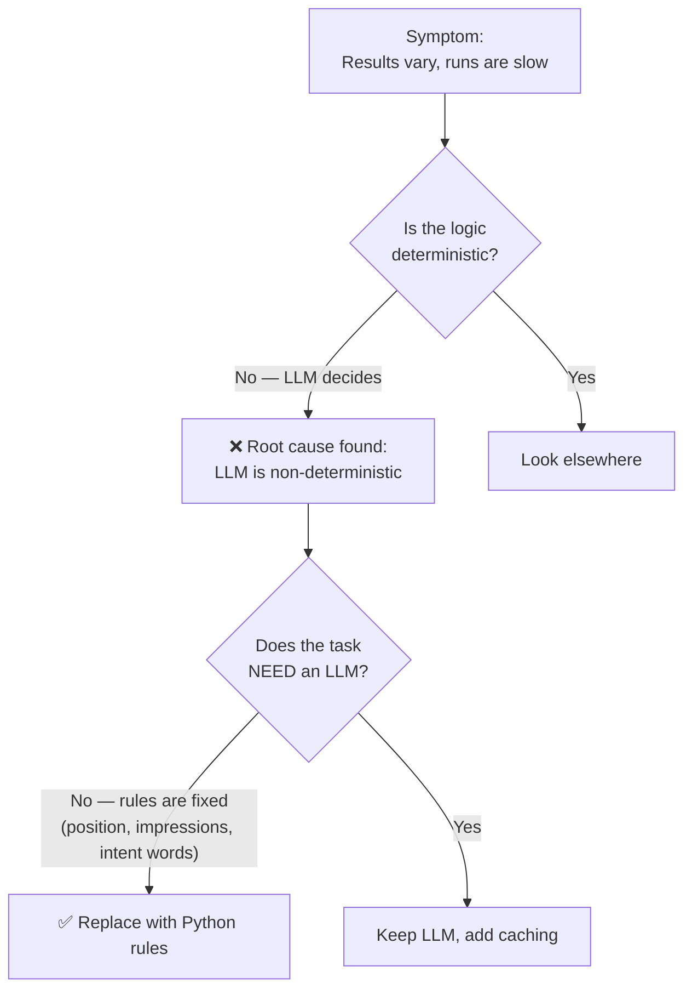

# Problem Diagnosis: Why Stage 1A Stopped Using Hermes

> [!abstract] In one line
> The Stage 1A engine was originally powered by **Hermes (an LLM running as a subprocess)**. It was replaced with **pure Python rules**. This document walks through the problem and the diagnostic approach that led to that fix.

---

## 1. The Problem (Symptom)

> [!danger] What was wrong
> Stage 1A's job is to score keyword opportunities and recommend an action (Improve / Expand / Create New). When this was powered by Hermes (an LLM), the system had **three practical problems**:
>
> 1. **Unpredictable results** — the same input file could produce *different* scores or recommendations on different runs.
> 2. **Slow** — each row triggered an LLM subprocess call, so a 20-row file took noticeably long.
> 3. **Costly & fragile** — every call cost money and could time out or fail.

The most serious one is **#1**, because a human approves these decisions. A decision engine that changes its mind run-to-run cannot be trusted or audited.

---

## 2. Diagnostic Approach (How We Investigated)

A structured, step-by-step check — not guesswork.



### Step-by-step

| Step | Question Asked | Finding |
|---|---|---|
| 1 | *What is the actual symptom?* | Same file → different output; slow per-row processing |
| 2 | *Where is the time/variance coming from?* | The LLM **subprocess call made for every row** |
| 3 | *Is the scoring logic actually fuzzy or fixed?* | **Fixed** — filters, score weights, and intent are simple rules |
| 4 | *Does this task truly require AI judgement?* | **No** — it's keyword matching + arithmetic + if/else |
| 5 | *What does the business need most here?* | **Repeatable, auditable** decisions a human can approve |

> [!note] The key diagnostic insight
> The work Stage 1A does is **rule-based, not judgement-based**. Intent is keyword matching. Scoring is fixed-point arithmetic. Recommendation is `if/else`. An LLM adds randomness and delay to a task that has one correct answer every time. **Using an LLM here was the wrong tool for the job.**

---

## 3. Root Cause

> [!bug] Root cause
> Stage 1A used a **non-deterministic, slow LLM (Hermes via subprocess)** to perform a task that is **fully deterministic and rule-based**. This caused unstable results, slow runs, and unnecessary cost — for no benefit, because the rules were already fixed in the spec (Deliverables 1–4).

---

## 4. The Fix

Replaced the LLM engine with a **pure Python rule engine** in [hermes_client.py](hermes_client.py).

```python
"""
hermes_client.py -- Pure Python Stage 1A analysis engine.
Replaces LLM subprocess calls with deterministic rule-based logic.
Returns results in the exact same format the frontend expects.
"""
```

**What was swapped, exactly:**

| Step | Old (Hermes / LLM) | New (Pure Python) |
|---|---|---|
| Intent (BOFU/MOFU/TOFU) | LLM guesses | Keyword-list match |
| Score 0–100 | LLM judges | Fixed 6-factor math |
| Recommendation | LLM reasons | `if/else` rules |
| Output format | (same) | **Identical** — frontend unchanged |

> [!tip] Important: the fix was invisible to the frontend
> The new engine returns the **exact same JSON format**, so nothing else in the app had to change. Only the engine underneath was replaced.

---

## 5. Result (Verification)

> [!success] After the fix
> | Measure | Before (Hermes) | After (Python) |
> |---|---|---|
> | **Same input → same output?** | ❌ No | ✅ Always |
> | **Speed** | Slow (LLM per row) | Instant |
> | **Cost** | Pays per call | Free |
> | **Can fail / time out?** | ❌ Yes | ✅ No |
> | **Auditable for approval?** | ❌ Hard | ✅ Yes |

**Verified by test run:** a 20-keyword sample now processes instantly and returns the *same* 20 scored opportunities every time (16 Critical, 13 "Improve Existing").

---

## 6. Honesty Note (What's Proven vs Inferred)

> [!warning] Be accurate when reporting this
> - **Documented in the code:** the engine was replaced to be **deterministic / rule-based** (this is written in the file).
> - **Strongly inferred, not documented:** that *speed* and *cost* were also reasons. These are logical consequences of removing per-row LLM subprocess calls, but no commit message or comment explicitly states "Hermes was too slow."
>
> **Safe way to state it:** *"The decision logic was rebuilt as deterministic Python rules so results are repeatable, instant, and free — important because a human approves every recommendation."*

---

## 7. Trade-off / Future Note

> [!info] What we gave up — and when to revisit
> Pure rules are simple keyword matching. They can't understand a phrase they've never seen.
>
> **When to bring an LLM back (Stage 1B+):** if we want *smarter* intent detection and richer written reasoning, an LLM could be added **on top** of the rules — used for explanation, not for the core score. That keeps the scoring deterministic while improving the human-facing reasoning.
