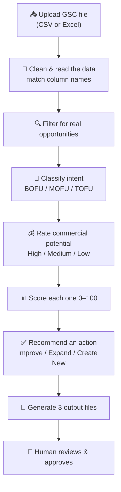

# Stage 1A — What I Built (Report for PM)

> [!abstract] One sentence
> Stage 1A is a tool that **reads Google Search Console data and tells Kriti which existing pages to improve before writing any new content.** It finds the opportunities, scores them, explains the recommendation, and puts them in a queue for a human to approve.

> [!important] The one rule everything follows
> **Optimize existing pages before creating new content.**
> If a page already ranks at position 8 for a keyword, we improve that page — we do **not** write a brand new blog.

---

## 1. The Problem We Solved

Before this tool, someone had to open the Search Console export and **manually read through hundreds of rows for hours**, guessing which pages were worth improving.

Stage 1A does that work **automatically in seconds** and explains *why* each choice was made.

| | Before (manual) | After (Stage 1A) |
|---|---|---|
| **Time** | Hours of reading | Seconds |
| **Decision** | Gut feeling | Scored 0–100 with reasons |
| **Output** | Notes in a doc | Report + CSV + approval queue |
| **Who decides** | One person, no audit | Human approves, fully tracked |

---

## 2. The Flow (How It Works)



**In plain words, the system does 6 things to every row of data:**

1. **Reads the file** — accepts a Search Console export (CSV *or* Excel). It auto-corrects different column names (e.g. "url" vs "page", "keyword" vs "query").
2. **Filters out the noise** — keeps only rows worth acting on (rules below).
3. **Figures out the search intent** — is the person *buying*, *researching*, or *just learning*?
4. **Rates how commercial it is** — High / Medium / Low money potential.
5. **Scores it 0–100** — using 6 weighted factors.
6. **Recommends an action and explains why** — then puts it in a queue for approval.

---

## 3. The Rules Behind the Decisions

> [!note] Filter — what counts as an "opportunity"
> A row is only kept if **all three** are true:
> - **Position 3–20** → not already #1 (no room to grow), not too far back to matter
> - **Impressions ≥ 50** → real people actually search for it
> - **Has both a keyword AND a page** → there's an existing page to improve

> [!note] Intent — what is the searcher trying to do?
> - **BOFU** (Bottom of Funnel) → ready to buy → *"best", "pricing", "review", "software", "demo"*
> - **MOFU** (Middle of Funnel) → researching → *"how to choose", "features", "guide"*
> - **TOFU** (Top of Funnel) → just learning → *"what is", "definition"*

> [!note] Score — 6 factors add up to 100
> | Factor | Max Points | Meaning |
> |---|---|---|
> | Existing page found | 25 | Is there a page to improve? |
> | Position upside | 20 | How much room to climb |
> | Impressions | 15 | How much demand |
> | Intent | 20 | Buyer intent scores highest |
> | Commercial potential | 10 | Money value |
> | Keyword difficulty fit | 10 | How realistic to win |
>
> Score then becomes a **Priority**: 80+ = Critical, 65+ = High, 50+ = Medium, below = Low.

> [!success] Recommendation — the final call
> - **Improve Existing** → page ranks in top 10 with buyer/research intent → optimize it
> - **Expand Existing** → page ranks 11–20 → needs more depth to break into page 1
> - **Create New Content** → no existing page found → defer to a later stage

---

## 4. What Comes Out (The Deliverables)

The system produces **3 files + a live dashboard**, every one of them complete:

| Deliverable | What it is | Status |
|---|---|---|
| 📄 **Markdown Report** | Ranked opportunities + a written reason for each | ✅ Done |
| 📊 **CSV Export** | Sortable/filterable table of every opportunity | ✅ Done |
| 📋 **YAML Approval Queue** | One entry per opportunity, status: `needs_review` | ✅ Done |
| 🖥️ **Dashboard (web UI)** | Upload file, see results, approve/reject in the browser | ✅ Done |

> [!tip] Human stays in control
> Nothing moves forward automatically. Every opportunity sits at **`needs_review`** until a person clicks **Approve**, **Reject**, or **Needs Review**. Approvals are tracked.

---

## 5. Proof It Works (Real Test Run)

I ran the system on a sample Search Console export of **20 keywords**:

```text
Input:        20 rows
Opportunities: 20 found
Priority:      16 Critical  |  4 High
Action:        13 Improve Existing  |  7 Expand Existing
```

**Example output the system generated automatically:**

> **Keyword:** medical billing software
> **Current Position:** 5 · **Impressions:** 3,100 · **Clicks:** 150
> **Existing Page:** /medical-billing
> **Intent:** BOFU · **Commercial Potential:** High
> **Score:** 95/100 → **Priority: Critical**
> **Recommendation:** ✅ Improve Existing
> **Reason:** *Already ranks #5 for a high-value buyer keyword with strong impressions. Optimizing the existing page is the fastest way to climb.*

This is the key win: **the system doesn't just give a number — it explains the "why" in plain language.**

---

## 6. How to Report This to the PM (Talking Points)

> [!quote] If you only say 4 things, say these:
> 1. **"Stage 1A is complete and working end-to-end"** — upload a file, get scored recommendations, approve them.
> 2. **"It enforces Kriti's core rule"** — improve existing pages before creating new ones.
> 3. **"Every recommendation is explained and scored"** — no guessing, fully auditable.
> 4. **"A human approves everything"** — nothing is automated without sign-off.

**Suggested one-paragraph summary to send her:**

> *"Stage 1A — the Opportunity Finder — is complete. It takes a Google Search Console export, automatically filters for the pages worth improving (position 3–20 with real search demand), classifies search intent, scores each opportunity 0–100 across 6 factors, and recommends whether to Improve, Expand, or Create New content — with a written reason for each. Output is delivered as a ranked report, a CSV, and an approval queue, plus a dashboard where the team reviews and approves. I tested it on a 20-keyword sample: it returned 20 scored opportunities (16 Critical) and correctly recommended improving existing pages over new content. Ready to demo."*

---

## 7. Demo Script (2 minutes)

```text
1. Open the dashboard
        ↓
2. Upload the Search Console file
        ↓
3. System instantly shows ranked opportunities
        ↓
4. Click one → see score, intent, and the reason
        ↓
5. Click Approve
        ↓
6. Show it moves into the approval queue
```

---

## 8. Scope Note (Be Clear About Boundaries)

> [!warning] What Stage 1A is — and is NOT
> **It IS:** the *Opportunity Finder* — find, score, explain, queue for approval.
> **It is NOT yet:** writing content briefs, generating drafts, or publishing. Those are later stages (2–6).
>
> Stage 1A's job ends the moment a human approves an opportunity. Approved items become the **input** for the next stage.

---

## 9. Where We Go Next

```text
✅ Stage 1A — Opportunity Finder            (DONE — this report)
🔜 Stage 1B — Add confidence %, deeper reasoning, SEO suggestions
⬜ Stage 2  — Content Brief Generation
⬜ Stage 3  — AI Draft Generation
⬜ Stage 4  — Quality Validation
⬜ Stage 5  — Publishing
⬜ Stage 6  — Performance Monitoring
```

> [!info] Recommendation for the PM
> Stage 1A already covers everything the original spec asked for. The natural next step (Stage 1B) is to make the recommendations even smarter — add a **confidence %**, more detailed reasoning, and **specific SEO improvement suggestions** for each page — before we move into writing content in Stage 2.
